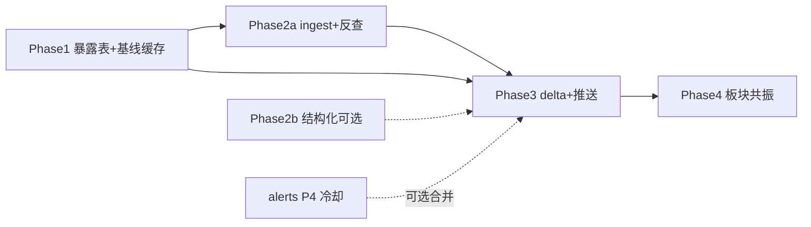

# 事件驱动暴露图谱与盘中增量分析 — 需求文档

> **状态**：Phase 1–5 已落地（含 Web 运营页）  
> **版本**：v0.5.0  
> **整理日期**：2026-06-27  
> **适用范围**：**A 股**（沪深北）；港股/美股标的不在本版需求范围内  
> **关联文档**：[实时告警中心](alerts.md)、[分析上下文包](analysis-context-pack.md)、[通知能力基线](notifications.md)

---

## 1. 背景与目标

### 1.1 背景

当前 DSA 已具备：

- **定时全量分析 + 推送**（`SCHEDULE_TIME` → `run_full_analysis` → `NotificationService`）
- **历史分析存档**（`analysis_history`，含 `context_snapshot`）
- **规则型盘中告警**（`AlertWorker` + `EventMonitor`：价格突破、涨跌幅、放量等）
- **按股票检索新闻**（`search_stock_news` / `search_comprehensive_intel`，含 direct / sector / macro 分层及 `announcements` 维度）
- **本地慢变基本面缓存**（`stock_listing`、`financial_abstract`、`valuation_daily` 等）
- **交易日历与市场阶段**（`trading_calendar`、`is_market_open`、`market_phase`）
- **持仓组合**（`portfolio_positions` 等）

上述能力以 **「日频复盘 + 按股票名 Pull 新闻 + 价量规则告警」** 为主。尚未覆盖用户期望的终态：

> 交易日内出现新闻、公告等**消息面**时，结合**上次分析结论**、**公司真实业务暴露关系**与**当前价格/技术态**，对 **A 股标的**做**快速增量研判**，并及时推送到已配置渠道。

### 1.2 产品目标

1. **事件驱动**：消息面触发分析，而非仅依赖定时任务。
2. **增量研判**：以上次完整分析为基线，输出「变化 + 是否调整观点」，避免整份日评复读。
3. **跨主体传导**：新闻不必点名 A 股代码；通过**暴露图谱**推导二阶影响（产业链、股权投资、客户依赖等）。
4. **可解释推送**：每条推送附带传导链、置信度、相对基线的变化说明。
5. **分层共振识别**：区分「单边传导」与「板块/行业集体爆发」两种机制。

### 1.3 非目标（本版不做）

| 项 | 说明 |
|----|------|
| 秒级高频行情与自动交易 | 盘中分析接受分钟级延迟 |
| 全市场全自动知识图谱 | 需人工主题包与来源标注 |
| 投资建议合规背书 | 推送为信息参考，含固定免责 |
| 替代定时全量报告 | 与之互补 |
| **港股/美股标的分析** | 本版图谱、事件、推送均仅面向 A 股 `code` |
| **大 V / 自媒体信源** | 不在本版功能范围（见 §1.4 备忘） |
| **扩展 `EventMonitor` 新 alert_type** | 消息面走独立 Worker，不塞进价量告警模型 |

### 1.4 范围外备忘（防止遗忘，非本版功能）

以下议题已知重要，** deliberately 不纳入 v0.2 功能项**，仅作后续版本备忘：

1. **海外市场传导**：日韩、美股等外部市场动态（如美股科技龙头财报、联储政策、日韩半导体景气）对 A 股的情绪与板块传导。实现时需单独建设「海外实体 → A 股暴露」层，与本文 A 股图谱类似但信源与时区不同。
2. **大 V / 自媒体订阅**：谣言与噪声高，需独立信源分级与人工审核，不与公开新闻 Push 混用。
3. **全自动供应链图谱**：果链等仍需 curated 主题包 + 公告核实，不做无监督全市场抽取。

---

## 2. 问题陈述

### 2.1 按股票名搜新闻的局限

现有 `search_stock_news(stock_code, stock_name)` 属于 **Pull 模式**：分析某股时才去搜该股相关新闻。

无法有效覆盖：

| 场景 | 示例 | 为何 Pull 失效 |
|------|------|----------------|
| 产业链传导 | 存储紧缺 → 利好 A 股存储链 | 新闻可能不出现 A 股公司名 |
| 股权投资暴露 | 合肥城建参股长鑫 → 长鑫景气带动股价 | 新闻关于长鑫，与「合肥城建」无字面关联 |
| 行业贝塔 | 存储概念板块集体上涨 | 需板块层聚合，非单股新闻 |

> **说明**：上例中「苹果涨价」仅作**国内新闻叙事中的实体**（Layer 1），用于命中预建的 A 股果链/存储暴露边；**不表示本版支持美股分析或自动美股行情联动**。

### 2.2 现有告警的局限

`AlertWorker` 触发后发送**规则型短告警**，可附 `analysis_history` 摘要，但**不进行 LLM 增量再分析**，且不处理消息面事件。

`sentiment_shift` 等在 [alerts.md](alerts.md) 中为**占位类型**；告警中心冷却（`alert_cooldown`）在 **P4** 才具备完整执行语义。本需求**不扩展** `EventMonitor` 规则类型，而是新增独立 **`ExposureEventWorker`**（见 §5.3）。

### 2.3 核心洞察

- **表观主业** vs **真实定价暴露**（主题、参股、供应链）须分开建模。
- **慢变关系可缓存**；盘中只做命中、反查、增量判定。
- **单一事实来源（SSOT）**：暴露边以 `company_exposure` 为准，避免多处维护同一关系。

---

## 3. 核心概念

### 3.1 消息面（本版）

本版消息面信源：

| 等级 | 来源 | 默认可信度 | 本版 |
|------|------|------------|------|
| S | 交易所/巨潮公告 | high | ✅ 优先 |
| A | 主题关键词搜索 + 权威媒体 | medium～high | ✅ |
| B | 行业/主题泛新闻 | medium | ✅ |
| C | 大 V / 自媒体 | low | ❌ 不做 |

### 3.2 分析基线（Baseline）

从 `analysis_history` 抽取并写入 `analysis_baseline_cache`（见 §6.5）。盘中增量只输出 **delta**。

**基线有效性契约**（硬规则）：

| 基线年龄（交易日） | 行为 |
|-------------------|------|
| ≤ 3 | 允许完整 delta 分析与观点调整推送 |
| 4～7 | 允许推送，但 `vs_baseline` 须标注「基线偏旧」 |
| > 7 或无基线 | 不推送操作建议变化；仅 Web/日志记录事件命中，或提示「需全量分析」 |

收盘后定时全量分析应**刷新基线**，并视为当日盘中增量结论的失效/复核点。

### 3.3 暴露图谱（A 股）

```
Layer 1  实体/主题节点     长鑫、存储紧缺、国产替代（仅作 NER 命中与反查键）
Layer 2  A 股公司节点     6 位 code + company_profile
Layer 3  板块/行业节点   概念板块（东财）、industry_ths、get_sector_rankings
```

**边**存于 `company_exposure`；**表观主业**存于 `company_profile`，不重复挂在每条边上。

### 3.4 两种爆发机制

| 机制 | 特征 | 推送策略 |
|------|------|----------|
| **边传导** | 事件命中实体，少数关联 A 股 | Top-N 个股增量推送，附传导链 |
| **板块共振** | 概念/行业成分集体异动 | 板块 digest；自选股附相对强弱 |
| **叠加** | 板块涨 + 个股显著强于板块 | 合并表述，标注龙头/影子 |

### 3.5 推送发现模式

| 模式 | 配置 | 行为 |
|------|------|------|
| `watchlist_only` | `EVENT_PUSH_SCOPE=watchlist` | 仅推送已在自选股（`STOCK_LIST`）中的命中股 |
| `discover` | `EVENT_PUSH_SCOPE=discover` | 未在自选股中的命中股：默认仅 **事件 inbox（Web/日志）**；可选低优先级 digest |
| `portfolio_boost` | 与上组合 | 持仓组合内命中股提高 `severity` 排序权重 |

默认推荐 **`watchlist_only`**，避免图谱反查刷屏；`discover` 需显式开启。

### 3.6 配置 vs 图谱：职责分离（重要）

| 层次 | 职责 | 数据来源 | 不应放在 `.env` 的内容 |
|------|------|----------|------------------------|
| **运行配置** | Worker 开关、轮询间隔、推送范围、冷却 | `.env` | — |
| **暴露图谱** | 谁与谁有何关系、传导方向与强度 | 公告/年报抽取、主题包冷启动、图谱同步 | 具体产业链关系、影子股列表 |
| **实体别名** | 新闻中如何命中 Layer 1 实体 | 随暴露边同步、公告 NER（后续） | 用 `THEME_NEWS_KEYWORDS` 枚举业务主题 |
| **Ingest 查询词** | 拉取哪些主题新闻 | **从图谱 `entity_alias` 自动推导** | 长期维护「长鑫,存储,…」 |

**原则**：

1. 新闻/公告只回答「发生了什么」；**哪些 A 股受影响**由 `company_exposure` 反查决定。
2. `config/themes/*.yaml`、合肥城建/长鑫等仅为 **冷启动示例**，不是要求每个产业链都写进配置。
3. `THEME_NEWS_KEYWORDS` 降级为 **fallback**（`EXPOSURE_INGEST_QUERY_MODE=keywords|both`），默认 `graph` 模式不读取。
4. 终态：暴露边主要来自 **公告/年报自动抽取** + 可选人工校对；主题包仅用于试点种子。

**当前实现（v0.4.0）**：

- `SectorResonanceService`：板块涨跌榜与实体命中交叉验证，推送板块 digest。
- `EventDeltaProcessor`：主题新闻优先板块 digest；公告仍走边传导。
- `ExposureEdgeExtractor`：从公告文本抽取暴露边（`source=announcement`），自动扩展 `entity_alias`。
- `ExposureGraphSyncService.build_ingest_queries_from_graph()`：按暴露边权重从库内别名生成搜索词。
- `sync_watchlist_company_entities()`：为自选股注册 `cn:{code}` 实体节点（标题直接点名时用）。
- `ensure_entity_aliases_from_exposures()`：边表中的 `target_entity_id` 自动补全别名占位。

---

## 4. 典型用例

### 4.1 产业链传导（叙事实体 → A 股存储链）

**国内新闻**：存储供需紧张、涨价预期（标题未必含 A 股代码）。

**系统行为**：

1. 实体命中：标题/摘要与 `entity_alias` 子串匹配（别名来自图谱：公告抽取、主题包冷启动、同步补全）
2. 反查 `company_exposure`（边由公告/年报抽取或冷启动种子写入）
3. 候选评分 Top-N → 增量分析 → 条件推送

### 4.2 股权投资暴露（合肥城建 ↔ 长鑫，**示例**）

> 以下为说明传导逻辑的**示例数据**，通过主题包/公告抽取写入图谱后，系统即可自动反查；**无需**在 `.env` 中配置「长鑫」关键词或手工维护股票映射表。

**图谱边示例**（`company_profile` 与 `company_exposure` 分离）：

```yaml
# company_profile
code: "002208"
surface_business: 房地产/城建开发
pricing_notes: 市场常按长鑫主题定价，地产主业偏弱

# company_exposure
code: "002208"
target_entity_id: changxin
link_type: equity_investment
direction: positive
strength: medium
pricing_driver: theme_overlay
summary: 参股长鑫相关主体，主题联动为主
source: manual  # 实施前须核实公告/年报
source_ref: "待填：公告日期、持股比例"
```

**数据核实清单（试点必填）**：

- [ ] 投资主体名称（上市公司 vs 子公司）
- [ ] 持股比例或投资金额（公告来源）
- [ ] 市场定价逻辑是否有历史验证（可选回测备注）

### 4.3 板块共振

1. 概念成分 + `get_sector_rankings` 验证板块领涨
2. 判定 `sector_resonance`，推送板块 digest
3. 若同时有个股边传导事件，按 §7.6 冲突裁决合并

---

## 5. 目标架构

### 5.1 总体流水线

```
┌─────────────────────────────────────────────────────────┐
│ Phase A：闲时构建                                        │
│  公告/年报抽取 → company_exposure / entity_alias（主路径）  │
│  主题包 YAML → 冷启动种子（可选）                          │
│  company_profile 维护 · 全量分析后写 analysis_baseline_cache │
└─────────────────────────────────────────────────────────┘
                          ↓
┌─────────────────────────────────────────────────────────┐
│ Phase B：盘中事件（ExposureEventWorker，独立于 AlertWorker）│
│  公告/主题新闻 ingest → 实体命中 → 图谱反查 → event_signal  │
│  （可选）板块共振检测                                     │
└─────────────────────────────────────────────────────────┘
                          ↓
┌─────────────────────────────────────────────────────────┐
│ Phase C：门控 + 增量分析                                   │
│  基线有效性 · Top-N · 候选评分 · 轻量 LLM delta           │
└─────────────────────────────────────────────────────────┘
                          ↓
┌─────────────────────────────────────────────────────────┐
│ Phase D：推送                                            │
│  NotificationService (route_type=alert)                   │
│  事件专用冷却表 · 合并 · severity                        │
│  （可选）写入 alert_trigger 形态供告警中心查询               │
└─────────────────────────────────────────────────────────┘
```

### 5.2 与现有模块关系

| 现有模块 | 本需求中的角色 |
|----------|----------------|
| `analysis_history` | 基线原始来源 |
| `analysis_baseline_cache` | 盘中增量读取层（新建） |
| `search_service` | 主题新闻 Pull、公告搜索；**不**把无 code 事件写入 `NewsIntel` |
| `AlertWorker` / `EventMonitor` | **仅价量告警**；与本需求并行，互不扩展规则类型 |
| **`ExposureEventWorker`** | **新建**：消息面 ingest、反查、增量分析、推送 |
| `NotificationService` | 统一推送出口 |
| `event_driven.yaml` | 增量分析 Prompt 参考 |
| `stock_listing.industry_ths` | 行业成分粗筛 |
| `get_sector_rankings` / `related_boards` | 板块共振与概念验证 |
| `portfolio_positions` | 持仓加分、提高推送优先级 |
| `history_comparison_service` | 可选：对齐「信号变化」字段，避免重复造契约 |
| `trading_calendar` / `is_market_open` | 交易时段门控 |
| `FundamentalSnapshot` | 长期可演进为 `company_profile` 来源之一；**本版不依赖其读取** |

### 5.3 双 Worker 并行（重要决策）

```
schedule 进程
├── agent_event_monitor (AlertWorker)     # 价量规则，已有
└── exposure_event_worker (新建)          # 消息面 + 图谱 + delta LLM
```

**禁止**为 `EventMonitor` 新增 `news_mention` / `exposure_hit` 等 `alert_type`，以免与 [alerts.md](alerts.md) 分阶段路线图冲突。

### 5.4 三通道信息入口

| 通道 | 模式 | 用途 |
|------|------|------|
| **Pull-股** | `search_stock_news(code)` | 定时全量、用户主动分析 |
| **Push-主题** | 图谱推导查询词 + `entity_alias` 轮询 | 盘中间接传导 |
| **Push-公告** | 自选股/主题相关公告监控 | 高可信 S 级事件，优先处理 |

去重：URL 唯一 + 同主题 15 分钟内标题相似度（简单归一化即可，不必上向量库）。

---

## 6. 数据模型

> 遵循 [alerts.md](alerts.md) 约定：新表须幂等初始化、默认关闭不影响现有功能、文档化回滚方式。

### 6.1 数据 SSOT 原则

| 数据 | 唯一来源 | 说明 |
|------|----------|------|
| A 股暴露边 | `company_exposure` | 反查、分析、推送均读此表 |
| 实体别名 | `entity_alias` | 服务 NER 命中，不存成员列表 |
| 主题包 | `config/themes/*.yaml` | **导入脚本**写入 `company_exposure`；包内 `members` 不单独持久化为第二套真相 |
| 表观主业 | `company_profile` | 公司级，不在边上重复 |
| 主题事件 | `event_signal` | **不用** `NewsIntel`（该表 `code` 非空，语义为 per-stock 情报） |

### 6.2 `entity_alias` — 实体别名（Layer 1）

| 字段 | 类型 | 说明 |
|------|------|------|
| `entity_id` | string | 如 `changxin`、`storage_shortage` |
| `display_name` | string | 长鑫存储 |
| `aliases` | json | `["长鑫","CXMT","国产存储"]` |
| `entity_type` | enum | `theme` / `product` / `policy` / `sector_tag` |
| `updated_at` | datetime | |

### 6.3 `company_profile` — A 股公司画像

| 字段 | 类型 | 说明 |
|------|------|------|
| `code` | string(6) | PK |
| `name` | string | |
| `surface_business` | string | 表观主业 |
| `pricing_notes` | text? | 市场定价逻辑备注 |
| `industry_ths` | string? | 可冗余缓存 |
| `updated_at` | datetime | |

### 6.4 `company_exposure` — 暴露边（核心）

| 字段 | 类型 | 说明 |
|------|------|------|
| `id` | int | PK |
| `code` | string(6) | A 股代码 |
| `target_entity_id` | string | 关联 `entity_alias.entity_id` |
| `link_type` | enum | §6.6 |
| `role` | string | 如「模组」「参股」 |
| `strength` | enum | high / medium / low |
| `exposure_pct` | float? | 持股比、收入占比 |
| `direction` | enum | positive / negative / neutral |
| `pricing_driver` | enum | core_business / theme_overlay / mixed |
| `summary` | text | 1～3 句 |
| `source` | enum | annual_report / announcement / manual / concept_board / theme_pack |
| `source_ref` | string? | 公告日期、年报定位 |
| `verified_at` | datetime? | manual 来源须有 |
| `ttl_days` | int | 默认 90；年报后强制重扫 |

**索引**：`(target_entity_id)`、`(code)`。

### 6.5 `analysis_baseline_cache`

| 字段 | 说明 |
|------|------|
| `code` | A 股代码 |
| `baseline_history_id` | 来源 `analysis_history.id` |
| `operation_advice` | |
| `core_thesis` | |
| `risks` | |
| `key_levels` | JSON |
| `price_at_analysis` | |
| `tech_summary` | |
| `exposure_digest` | 暴露摘要（生成时可拼接） |
| `created_at` | 基线时间 |

每次对该股**成功完成全量分析**后 upsert；盘中只读最新一条。

### 6.6 `link_type` 与方向传播

| 值 | 含义 | 默认 direction |
|----|------|----------------|
| `supply_chain` | 供应链 | 事件利好上游常为 positive |
| `equity_investment` | 股权投资 | positive（主题） |
| `subsidiary` | 控股/子公司 | positive |
| `revenue_share` | 客户/收入依赖 | 视事件而定 |
| `concept` | 概念联动 | positive，**低权重** |
| `substitute` | 替代/竞争 | 竞品利好为本股 **negative** |

**负向传导**：事件对实体为利好时，沿 `substitute` 边标记竞品；对下游成本压力场景（如「原料涨价」），`supply_chain` 下游边 direction 可为 negative。增量分析 Prompt 须传入 `direction`。

### 6.7 `event_signal` — 盘中事件（专用表）

| 字段 | 说明 |
|------|------|
| `id` | PK |
| `source_type` | news / announcement |
| `source_url` | 唯一去重 |
| `title` | |
| `snippet` | |
| `published_at` | |
| `entities` | JSON：命中 entity_id 列表 |
| `event_type` | 政策/业绩/紧缺/涨价/… |
| `sentiment` | positive / negative / neutral |
| `matched_codes` | JSON：[{code, edge_id, score}] |
| `resonance_sector` | 若板块共振 |
| `dedup_key` | 主题归一化键 |
| `status` | pending / analyzed / pushed / skipped / failed |
| `skip_reason` | 如 baseline_stale / low_confidence / non_trading_hours |
| `processed_at` | |

### 6.8 `event_push_cooldown` — 事件推送冷却（本版自建）

告警中心 P4 之前，本需求**自建**轻量冷却表，字段对齐 [alerts.md](alerts.md) `alert_cooldown` 语义，便于日后合并：

| 字段 | 说明 |
|------|------|
| `code` | 股票 |
| `cooldown_until` | |
| `last_event_signal_id` | |
| `reason` | |

### 6.9 主题包 YAML 示例（导入用）

```yaml
id: changxin_chain
display_name: 长鑫产业链
entity_aliases:
  - entity_id: changxin
    aliases: [长鑫, 长鑫存储, CXMT, 国产存储]
exposures:
  - code: "002208"
    target_entity_id: changxin
    link_type: equity_investment
    strength: medium
    direction: positive
    pricing_driver: theme_overlay
    summary: 参股长鑫相关主体，主题联动
    source: manual
    source_ref: "核实：公告/年报"
```

试点包：**`changxin_chain`**（冷启动示例，可选）；`storage_concept`、`apple_chain_cn` 次之。

---

## 7. 事件处理逻辑

### 7.1 实体识别（分步实施）

**Phase 2a — 图谱别名匹配（已实现）**

```
text = title + snippet
entities = []
FOR alias IN entity_alias:          # 别名来自 DB，非 .env 枚举
  IF alias IN text: entities.append(entity_id)
```

Ingest 侧查询词由 `ExposureGraphSyncService.build_ingest_queries_from_graph()` 从暴露边推导；`THEME_NEWS_KEYWORDS` 仅在 `EXPOSURE_INGEST_QUERY_MODE=keywords|both` 时作 fallback。

**Phase 2b — 公告抽取补全图谱（已实现）**

- `ExposureEdgeExtractor`：从自选股相关公告标题/摘要用规则抽取参股、投资、联营、供货、合作等关系
- 写入 `company_exposure`（`source=announcement`），并自动扩展 `entity_alias`
- CLI：`python main.py --extract-exposure-edges`；闲时：`EXPOSURE_EXTRACTION_ENABLED=true`

**Phase 2b+ — 结构化事件扩展（待做）**

- 公告类型字段规则（业绩预增、增持、订单）
- 轻量 LLM 抽取 `event_type` / `sentiment`（仅 S/A 级信源或 Top 事件）
- 年报「长期股权投资」段落结构化抽取（当前公告正则已覆盖部分句式）

不在本版要求通用 NER 模型。

### 7.2 反查与候选评分

```
candidates = []
FOR entity IN entities:
  candidates += company_exposure WHERE target_entity_id = entity

score = strength_weight(link_type, strength)
      + watchlist_bonus(code in STOCK_LIST)
      + portfolio_bonus(code in portfolio_positions)
      - priced_in_penalty(change_pct since event)   # 可选预筛

SORT DESC → TAKE TOP_N (默认 5，可配置 EVENT_ANALYSIS_MAX_STOCKS)
```

### 7.3 推送门控（顺序执行）

1. `EXPOSURE_GRAPH_ENABLED` / `EVENT_DELTA_ANALYSIS_ENABLED`
2. A 股 code 合法且在 `stock_listing`
3. `is_market_open(cn)` 或配置允许盘后仅入库
4. 基线有效性（§3.2）
5. `EVENT_PUSH_SCOPE`（watchlist / discover）
6. `EVENT_PUSH_MIN_CONFIDENCE`
7. `event_push_cooldown` 未命中
8. 当日 LLM 调用预算未超限（见 §11）

非交易时段默认：`event_signal.status=skipped`，`skip_reason=non_trading_hours`；可配置 `EVENT_INGEST_OUTSIDE_SESSION=true` 仅入库。

### 7.4 增量分析 I/O

**输入**：事件摘要、暴露边（含 direction）、`company_profile`、`analysis_baseline_cache`、现价/涨跌幅、（可选）`history_comparison_service` 信号变化摘要。

**输出**：§7.5 字段；`transmission_chain` 必须引用 `source` / `source_ref`。

### 7.5 增量分析输出

| 字段 | 说明 |
|------|------|
| `verdict` | 利好 / 利空 / 中性 / 不确定 |
| `vs_baseline` | 维持 / 上调 / 下调 / 基线过期 |
| `transmission_chain` | 可读传导链 |
| `confidence` | high / medium / low |
| `priced_in` | bool |
| `invalidation` | 失效条件 |
| `should_push` | bool |
| `severity` | info / warning / critical |

### 7.6 事件冲突裁决

同一 `code` 在短窗口内多个信号：

| 优先级 | 类型 |
|--------|------|
| 1 | S 级公告 |
| 2 | 边传导 + high strength |
| 3 | 板块共振 digest 中的个股提及 |
| 4 | B 级泛新闻 |

合并为**一条 digest** 推送，不连发多条。

### 7.7 冷却与合并

| 规则 | 默认值 |
|------|--------|
| 同股冷却 | 45 分钟（`EVENT_PUSH_COOLDOWN_MINUTES`） |
| 同主题合并 | 15 分钟内 `dedup_key` 相同 |
| low confidence | 不推送，仅事件 inbox |
| 板块共振 | 发 1 条板块摘要，不逐股重复 |

### 7.8 推送文案模板

```markdown
### ⚡ 事件增量 · {name}({code})

**触发**：{title}（{source_type_label}）

**传导**：{entity_display} → {link_type}({direction}) → {code}
**相对基线**：{vs_baseline} — {one_line_reason}
**现价**：{price} ({change_pct}%) · 置信度：{confidence}

> {baseline_date} 基线：{core_thesis_short}
> 失效：{invalidation}

*仅供参考，不构成投资建议*
```

---

## 8. 数据来源与缓存

### 8.1 暴露边来源

| 来源 | 可信度 | 本版 |
|------|--------|------|
| 年报长期股权投资 | 高 | 部分句式已由公告抽取正则覆盖；全文结构化待做 |
| 重大公告 | 高 | ✅ `ExposureEdgeExtractor` |
| 主题包 manual | 中 | ✅ 冷启动种子（非主路径） |
| 概念成分 | 中 | 可选，标记 `concept` 低权重 |
| 全量分析 LLM 抽取 | 中 | 仅作草稿，**须人工 verified** |

### 8.2 缓存分层

| 层级 | 内容 | 更新 |
|------|------|------|
| L0 | `stock_listing`、`financial_abstract` | 已有每日同步 |
| L1 | `company_exposure`、`entity_alias`、`company_profile` | 公告抽取闲时任务 + 可选主题包导入 |
| L2 | `analysis_baseline_cache` | 每次全量分析后 |
| L3 | `event_signal` + ingest checkpoint | 每轮 worker |

---

## 9. 分阶段实施计划

### Phase 0 — 文档与设计对齐

- [x] 需求文档 v0.2
- [ ] 评审：ORM、与 `alerts.md` 边界、`ExposureEventWorker` 注册方式
- [x] 完成 `changxin_chain` 主题包草稿（**冷启动种子**；非运行时业务配置）

### Phase 1 — 暴露缓存 MVP

- [x] `entity_alias`、`company_profile`、`company_exposure`、`analysis_baseline_cache` ORM + `ExposureRepository`
- [x] CLI：`python main.py --import-theme-pack` / `scripts/import_theme_pack.py`
- [x] API：`GET /api/v1/exposure/by-entity/{id}`、`GET /api/v1/exposure/by-code/{code}`
- [x] 全量分析保存历史后写入 `analysis_baseline_cache`（`pipeline` 钩子）
- [ ] 年报股权投资全文结构化抽取（Phase 2b+）
- **不做** `graph_entity` 独立表；**不做** Web 管理页

**验收**：[x] `changxin` 反查含 `002208`；[x] `002208` 正查暴露边与 `company_profile` 一致。

### Phase 2a — 公告 + 图谱驱动 ingest + 反查

- [x] `event_signal` 表 + `EventSignalRepository`
- [x] `ExposureEventWorker`（独立于 `AlertWorker`）
- [x] 新闻标题 → `entity_alias` 命中 → `company_exposure` 反查 → `matched_codes`
- [x] **`ExposureGraphSyncService`：ingest 查询词从图谱推导**（默认 `EXPOSURE_INGEST_QUERY_MODE=graph`）
- [x] `THEME_NEWS_KEYWORDS` 仅 fallback（`keywords` / `both` 模式）
- [x] 自选股公告 ingest（`ANNOUNCEMENT_MONITOR_ENABLED`）
- [x] 写入 `event_signal`；不 LLM；不推送
- [x] 事件 inbox API + CLI + schedule 后台任务
- [x] 公告自动抽取暴露边（`ExposureEdgeExtractor`，Phase 2b）

**验收**：图谱内有边与别名后，**无需配置 `THEME_NEWS_KEYWORDS`** 即可从图谱生成查询词；「长鑫扩产」类标题反查含 `002208`（边可来自公告抽取或冷启动种子）。

### Phase 2b — 图谱自动补全 + 结构化事件

- [x] 公告抽取：`参股/投资/联营/供货/合作` → `company_exposure`（`source=announcement`）
- [x] 实体别名从抽取结果自动扩展
- [x] CLI `--extract-exposure-edges`；闲时 `EXPOSURE_EXTRACTION_ENABLED`
- [ ] 年报「长期股权投资」全文结构化抽取
- [ ] 公告类型规则 / 可选 LLM 填 `event_type`、`sentiment`

### Phase 3 — 增量分析 + 推送

- [x] `EventDeltaAnalysisService`：规则研判 + 可选轻量 LLM（`EVENT_DELTA_ANALYSIS_ENABLED`）
- [x] `EventDeltaProcessor`：Top-N 门控、基线过期规则、自选股范围、冷却
- [x] `event_push_cooldown` 表 + `EventPushCooldownRepository`
- [x] `NotificationService` 推送（`route_type=alert`），文案模板 §7.8
- [x] `ExposureEventWorker` ingest 后衔接 delta；CLI `--run-event-delta`
- [ ] 配置项进入 `config_registry` WebUI（待补）
- [ ] 可选：`alert_trigger` 形态写入（待补）

**验收**：端到端可推送 1 条可解释告警；同股冷却；基线 >7 天不推操作建议变化。

### Phase 4 — 板块共振

- [x] `SectorResonanceService`：概念/行业涨跌榜 + 实体别名交叉匹配
- [x] 成分上涨比例门控（`SECTOR_RESONANCE_MIN_MEMBERS` / `MIN_UP_RATIO`）
- [x] `event_sector_cooldown` 板块级冷却
- [x] 推送模板区分 `sector_resonance` digest（抑制主题新闻的逐股推送）
- [x] 公告（S 级）仍优先边传导个股推送（§7.6）

**验收**：存储概念集体上涨时 1 条板块 digest，不逐股刷屏。

### Phase 5 — 运营与质量

- [x] `exposure_feedback` 表：暴露边 / 事件误报与确认回流
- [x] 管理 API：`GET/PATCH/DELETE /exposure/edges`，`POST .../feedback`
- [x] 事件误报：`POST /events/signals/{id}/feedback`
- [x] 运行时反查自动排除 `inaccurate` / `disable` 的边
- [x] Web 管理页 `/exposure`（暴露边 + 事件 inbox）
- [ ] 可选：传导滞后回测

**验收**：用户可在 Web 标记「关联不准」后，后续 ingest 反查不再命中该边。

---

## 10. 配置项

```env
# 总开关
EXPOSURE_GRAPH_ENABLED=false
EXPOSURE_EVENT_WORKER_ENABLED=false

# 主题包（冷启动导入，非运行时轮询）
EXPOSURE_THEME_PACKS=changxin_chain

# Phase 2b：公告抽取暴露边（闲时，与基本面同步时段）
EXPOSURE_EXTRACTION_ENABLED=false
EXPOSURE_EXTRACTION_MAX_PER_CODE=5

# Ingest（查询词默认由图谱推导，见 EXPOSURE_INGEST_QUERY_MODE）
THEME_NEWS_INGEST_ENABLED=false
THEME_NEWS_INTERVAL_MINUTES=15
EXPOSURE_INGEST_QUERY_MODE=graph          # graph | keywords | both
EXPOSURE_INGEST_MAX_QUERIES=20
# 仅 fallback，graph 模式下可留空
THEME_NEWS_KEYWORDS=
ANNOUNCEMENT_MONITOR_ENABLED=false
EVENT_INGEST_OUTSIDE_SESSION=false

# 实体与反查
EVENT_ANALYSIS_MAX_STOCKS=5

# 增量分析
EVENT_DELTA_ANALYSIS_ENABLED=false
EVENT_DELTA_ANALYSIS_MODEL=
EVENT_LLM_DAILY_BUDGET=100

# 推送
EVENT_PUSH_COOLDOWN_MINUTES=45
EVENT_PUSH_MIN_CONFIDENCE=medium
EVENT_PUSH_SCOPE=watchlist          # watchlist | discover

# 板块共振
SECTOR_RESONANCE_ENABLED=false
SECTOR_RESONANCE_MIN_MEMBERS=5
SECTOR_RESONANCE_MIN_UP_RATIO=0.6
```

---

## 11. 非功能性需求

| 项 | 目标 |
|----|------|
| 端到端延迟（P95） | 事件入库 → 推送 < 90s（含 1 次 LLM） |
| LLM 预算 | 超 `EVENT_LLM_DAILY_BUDGET` 后仅入库不分析 |
| 搜索 API | `THEME_NEWS_INTERVAL_MINUTES` 与 provider 配额联动，失败 degrades 为 skipped |
| 可观测性 | 每条 `event_signal` 必有 `status` / `skip_reason`；worker 轮次日志 |
| 兼容性 | 所有开关默认 false；关闭时不新增表读写路径外的副作用 |
| 迁移 | 新表 `CREATE IF NOT EXISTS`；回滚 = revert + 可选保留表 |

---

## 12. 风险与约束

| 风险 | 缓解 |
|------|------|
| LLM 编造产业链 | 仅对 `company_exposure` 候选 Top-N 分析；引用 `source_ref` |
| 影子股炒作 | `theme_overlay` 默认较低 severity |
| 推送刷屏 | 冷却、Top-N、watchlist 默认、digest 合并 |
| 概念蹭热点 | `concept` 低权重；展示区分 link_type |
| 基线过期误导 | §3.2 硬规则 |
| 与 AlertWorker 混淆 | 独立 Worker + 文档明确 |
| 合规 | 固定免责；不做指令性买卖表述 |

---

## 13. 与定时全量分析的分工

| 场景 | 机制 |
|------|------|
| 收盘后定时任务 | 全量分析 → 刷新 `analysis_baseline_cache` → 复盘推送 |
| 盘中突发 | `ExposureEventWorker` 增量推送 |
| 无新消息 | 不打扰；`AlertWorker` 价量告警仍独立运行 |
| 用户主动分析 | 现有 Pipeline / Agent 不变 |

---

## 14. 验收标准（总览）

1. **图谱**：试点 `changxin_chain` 关系可正反查，边带来源可追溯到 `source_ref`。
2. **事件**：2a 阶段起，主题/公告命中实体后 `event_signal.matched_codes` 正确。
3. **增量**：输出含 `vs_baseline`、`transmission_chain`、`confidence`、`direction`。
4. **推送**：可配置渠道收到告警；冷却、Top-N、基线过期规则生效。
5. **共振**：板块 digest 不逐股重复（Phase 4）。
6. **范围**：仅 A 股 code；无港股/美股/海外盘面联动功能。

---

## 15. 开放问题（Open Questions）

1. 事件 inbox 是否做到现有 Web 侧边栏，还是 Phase 5 才做 UI？
2. `discover` 模式下非自选股是否允许「一键加入自选」？
3. 暴露边 Web 编辑是否需要多人 `owner_id`（暂按单用户实例）？
4. 日后是否与 `alert_cooldown` P4 合并为统一冷却服务？

---

## 16. 里程碑依赖



---

## 17. 附录：术语表

| 术语 | 定义 |
|------|------|
| 消息面 | 本版：公告 + 主题新闻搜索；不含大 V |
| 基线 | 最近一次全量分析的结构化结论 |
| 暴露边 | `company_exposure` 中的一条关系记录 |
| 影子股 | 主业弱相关、因参股/主题被定价的 A 股 |
| 边传导 | 事件沿暴露边传播至个别 A 股 |
| 板块共振 | 概念/行业成分集体异动 |
| SSOT | 暴露关系以 `company_exposure` 为唯一事实来源 |

---

## 18. 修订记录

| 版本 | 日期 | 说明 |
|------|------|------|
| v0.1 | 2026-06-27 | 初稿 |
| v0.2 | 2026-06-27 | 审阅修订：A 股范围、独立 ExposureEventWorker、SSOT 数据模型、基线过期、Top-N、板块数据源、事件专用表、与 alerts 对齐、海外/大V 记入备忘非功能项 |
| v0.2.1 | 2026-06-27 | Phase 1 落地：ORM、主题包导入、暴露 API、基线缓存钩子 |
| v0.2.2 | 2026-06-28 | Phase 2a 落地：event_signal、ExposureEventWorker、事件 inbox API |
| v0.2.3 | 2026-06-28 | 图谱驱动 ingest：`ExposureGraphSyncService`；`THEME_NEWS_KEYWORDS` 降为 fallback；§3.6 配置/图谱职责分离 |
| v0.2.4 | 2026-06-28 | Phase 2b：`ExposureEdgeExtractor`、公告抽取 CLI/闲时任务；文档对齐图谱主路径 |
| v0.3.0 | 2026-06-28 | Phase 3：`EventDeltaProcessor`、推送冷却、增量分析 CLI、Worker 衔接 |
| v0.4.0 | 2026-06-28 | Phase 4：`SectorResonanceService`、板块 digest、sector 冷却、冲突裁决 |
| v0.5.0 | 2026-06-28 | Phase 5：反馈表、暴露边管理 API、Web `/exposure` 运营页 |
